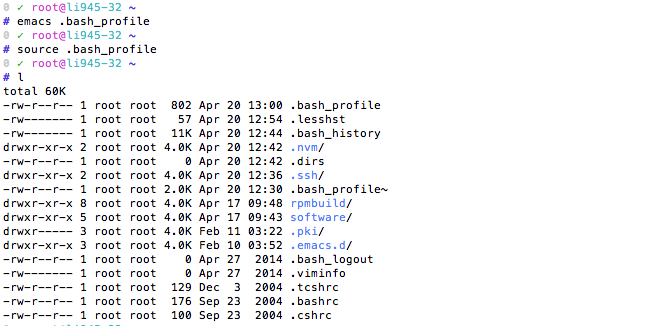

# bash_profile
Simple yet useful bash_profile

## how to use it?

1. Copy the content in `bash_profile.txt` and add it into your `.bash_profile` in your home folder(Usually you could open with `vim ~/.bash_profile`).
2. Use `source ~/.bash_profile` to make it take effect. Then you could use `l` to see the colorful terminal.

## TODO

Add a shell script to avoid the copy/paste work.

## Thanks

[@Sange](https://github.com/sangechen)
